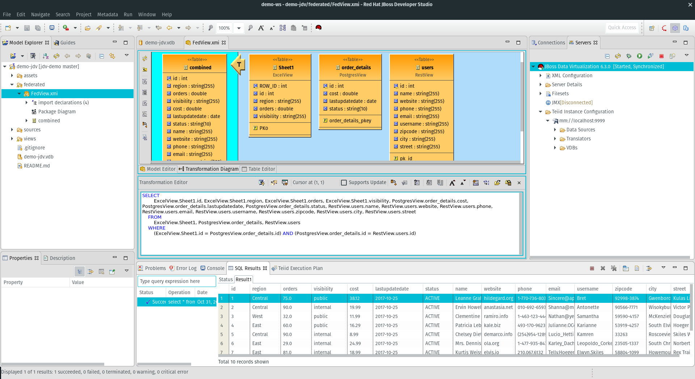

# jdv-demo

A demonstration JBoss Data Virtualization project that creates an [OData](http://www.odata.org) REST api that serves federated data from Postgresql, REST and Excel.  

## Build and Run
Import this project in JBoss Developer Studio (version 11.0)  as a Teiid Modeling project

## Usage
This project is built as part of a workshop and can be used for demonstration purposes

## References
[JBoss Data Virtualization](https://www.redhat.com/en/technologies/jboss-middleware/data-virtualization)

